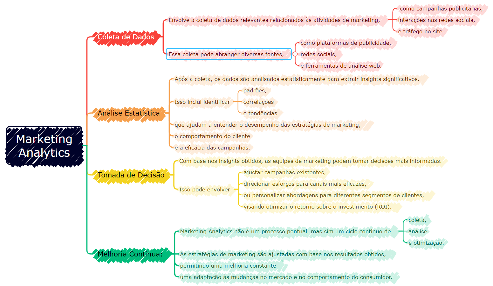
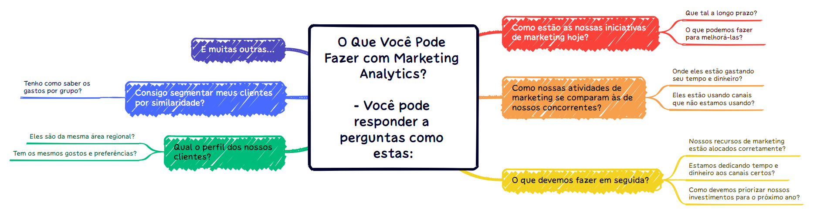
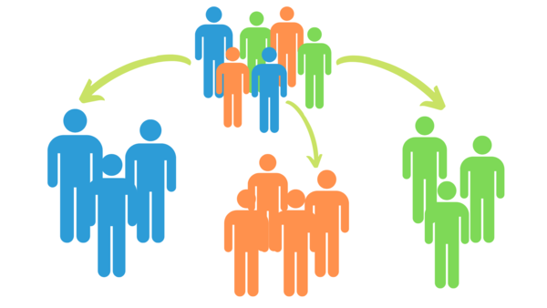
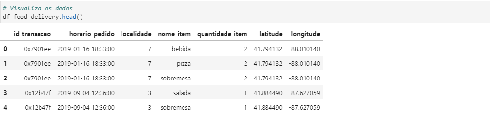

# Marketing Analytics

Marketing Analytics compreende os processos e tecnologias que permitem aos profissionais de Marketing avaliar o sucesso de suas iniciativas. 

-

Isso é feito medindo o desempenho das campanhas de Marketing, coletando os dados e analisando os resultados. Marketing Analytics utiliza métricas importantes de negócios, como ROI (Retorno Sobre o Investimento), Atribuição de Marketing e Eficácia Geral do Marketing. Em outras palavras, o Marketing Analytics mostra se os programas de Marketing estão sendo efetivos ou não.

Marketing Analytics reúne dados de todos os canais de marketing e os consolida em uma visão de marketing comum. A partir dessa visão comum, você pode extrair resultados analíticos que podem fornecer assistência inestimável para impulsionar os esforços de marketing.

-

Você pode responder a perguntas como estas:

-

## Projeto de Segmentação de Clientes - Food Delivery

-

A segmentação permite que os profissionais de marketing adaptem melhor seus esforços de marketing a vários subconjuntos de público-alvo.

-

## O Que é Segmentação de Clientes?

A segmentação de clientes é o processo de dividir os clientes em grupos com base em características comuns, para que as empresas possam comercializar para cada grupo de forma eficaz e adequada, ou simplesmente compreender o padrão de consumo dos clientes.

##  Marketing B2B x Marketing B2C

No Marketing Business-to-Business (B2B), uma empresa pode segmentar clientes de acordo com uma ampla variedade de fatores, incluindo:

- Indústria
- Número de empregados
- Produtos comprados anteriormente na empresa
- Localização

No Marketing Business-to-Consumer (B2C), as empresas geralmente segmentam os clientes de acordo com dados demográficos e padrões de consumo, tal como:

- Idade
- Gênero
- Estado civil
- Localização (urbana, suburbana, rural)
- Estágio da vida (sem filhos, aposentado, etc.)
- Produtos comprados
- Valor gasto
- Horário de consumo

## Como Segmentar Clientes?

A segmentação de clientes exige que uma empresa colete informações específicas - dados - sobre clientes e analise-as para identificar padrões que podem ser usados para criar segmentos.

Parte disso pode ser obtida a partir de informações de compra - cargo, geografia, produtos adquiridos, por exemplo. Algumas delas podem ser obtidas da forma como o cliente entrou no seu sistema. Um profissional de marketing que trabalha com uma lista de e-mail de inscrição pode segmentar mensagens de marketing de acordo com a oferta de inscrição que atraiu o cliente, por exemplo. Outras informações, no entanto, incluindo dados demográficos do consumidor, como idade e estado civil, precisarão ser adquiridas de outras maneiras.

Os métodos típicos de coleta de informações incluem:

- Entrevistas presenciais ou por telefone
- Pesquisas
- Coleta de informações publicadas sobre categorias de mercado
- Grupos de foco
- Dados de acessos a sistemas ou apps

## Usando Segmentos de Clientes

Características comuns nos segmentos de clientes podem orientar como uma empresa comercializa segmentos individuais e quais produtos ou serviços ela promove. Uma pequena empresa que vende guitarras feitas à mão, por exemplo, pode decidir promover produtos com preços mais baixos para guitarristas mais jovens e guitarras premium com preços mais altos para músicos mais velhos, com base no conhecimento do segmento que lhes diz que os músicos mais jovens têm menos renda disponível do que seus colegas mais velhos. 

A segmentação de clientes pode ser praticada por todas as empresas, independentemente do tamanho ou setor, e se vendem on-line ou presencialmente. Começa com a coleta e a análise de dados e termina com a atuação nas informações coletadas de maneira apropriada e eficaz, com a entrega das conclusões.

## Iniciando o Desenvolvimento do Projeto

### Carregando e Compreendendo os Dados

Dataset com 260645 linhas e 7 colunas

## Dicionário de Dados

|Variável                              | Descrição                                                             |
|--------------------------------------|-----------------------------------------------------------------------|
|id_transacao                          | ID da transação. Um mesmo ID pode ter vários itens de um pedido.      |
|horario_pedido                        | Horário exato do pedido.                                              |
|localidade                            | Localidade que processou o pedido (unidade do restaurante).           |
|nome_item                             | Nome do item (pizza, salada, bebida e sobremesa).                     |
|quantidade_item                       | Quantidade de itens no pedido.                                        |
|latitude                              | Latitude da localidade onde o pedido foi gerado.                      |
|longitude                             | Longitude da localidade onde o pedido foi gerado.                     |
|______________________________________|_______________________________________________________________________|

|calc|           bebida|         pizza|        salada|     sobremesa|
|count      100000.000000  100000.000000  100000.000000  100000.000000
|mean            1.239590       1.857840       0.711370       2.569210
|std             1.627886       1.588589       1.086524       1.332084
|min             0.000000       0.000000       0.000000       1.000000
|25%             0.000000       1.000000       0.000000       1.000000
|50%             0.000000       1.000000       0.000000       2.000000
|75%             3.000000       3.000000       1.000000       4.000000
|max             5.000000       5.000000       5.000000       5.000000

