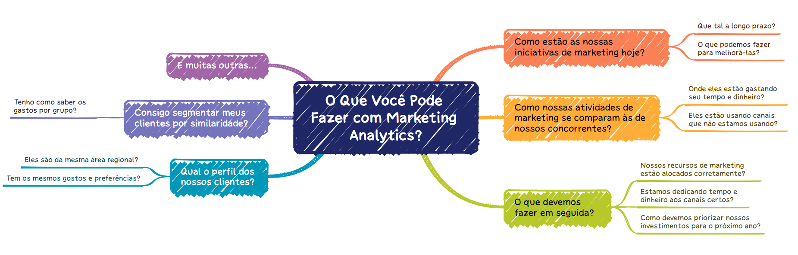

# Marketing Analytics

Marketing Analytics compreende os processos e tecnologias que permitem aos profissionais de Marketing avaliar o sucesso de suas iniciativas. 

-

Isso é feito medindo o desempenho das campanhas de Marketing, coletando os dados e analisando os resultados. Marketing Analytics utiliza métricas importantes de negócios, como ROI (Retorno Sobre o Investimento), Atribuição de Marketing e Eficácia Geral do Marketing. Em outras palavras, o Marketing Analytics mostra se os programas de Marketing estão sendo efetivos ou não.

Marketing Analytics reúne dados de todos os canais de marketing e os consolida em uma visão de marketing comum. A partir dessa visão comum, você pode extrair resultados analíticos que podem fornecer assistência inestimável para impulsionar os esforços de marketing.

-

-

## O Que Você Pode Fazer com Marketing Analytics?

Com Marketing Analytics, você pode responder a perguntas como estas:

- Como estão as nossas iniciativas de marketing hoje? Que tal a longo prazo? O que podemos fazer para melhorá-las?

- Como nossas atividades de marketing se comparam às de nossos concorrentes? Onde eles estão gastando seu tempo e dinheiro? Eles estão usando canais que não estamos usando?

- O que devemos fazer em seguida? Nossos recursos de marketing estão alocados corretamente? Estamos dedicando tempo e dinheiro aos canais certos? Como devemos priorizar nossos investimentos para o próximo ano?

- Qual o perfil dos nossos clientes? Eles são da mesma área regional? Tem os mesmos gostos e preferências?

- Consigo segmentar meus clientes por similaridade? Tenho como saber os gastos por grupo?

- E muitas outras...

## Projeto de Segmentação de Clientes - Food Delivery

-

A segmentação permite que os profissionais de marketing adaptem melhor seus esforços de marketing a vários subconjuntos de público-alvo.

A segmentação ajuda uma empresa a:

  - Criar  e  comunicar mensagens  de  marketing  direcionadas  que  ressoarão  com  grupos específicos de clientes, mas não com outros (que receberão mensagens personalizadas para suas necessidades e interesses).
  - Selecionar  o  melhor  canal  de  comunicação  para  o  segmento,  que  pode  ser e-mail, publicações em mídias sociais, publicidade em rádio ou outra abordagem, dependendo do segmento.
  - Identificar  maneiras  de  melhorar  produtos  ou  novas  oportunidades  de  produtos  ou serviços.
  - Estabelecer melhores relacionamentos com os clientes.
  - Testar as opções de preços.
  - Concentrar-se nos clientes mais rentáveis.
  - Melhorar o atendimento ao cliente.
  - Escolher entre venda por atacado e venda cruzada de outros produtos e serviços.

## Definição do Projeto

